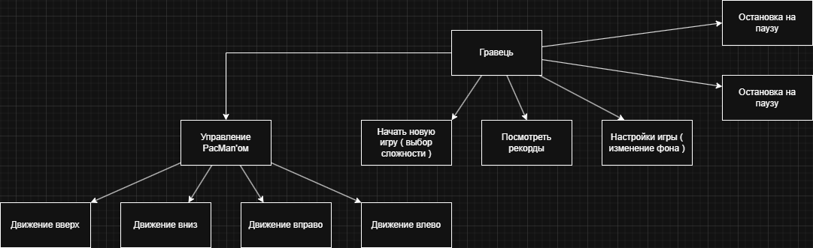
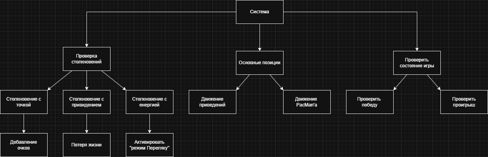

# Аналіз гри Pac-Man

### Основні функціональні вимоги
1.  **Керування персонажем:** 
    - Рух в чотирьох напрямках (вгору, вниз, вліво, вправо)
    - анімація відкривання/закривання рота
2. **Система точок:**
    - Звичайні точки (10 очок)
    - Енерджайзери (великі точки, 50 очок)
    - Фрукти (бонусні предмети)
3. **Поведінка привидів:**
    - 4 привиди з різними характерами
    - Режими: переслідування, переляк
    - Відродження після з'їдання
4. **Ігрові стани:**
    - Головне меню
    - Гра 
    - Пауза
    - Game Over 
    - Перемога
5. **Система рівнів:**
    - Збільшення складності
    - Бонуси за проходження
    - Зміна фону головного меню
    - Зміна фону для головного екрану гри

## Діаграми 

